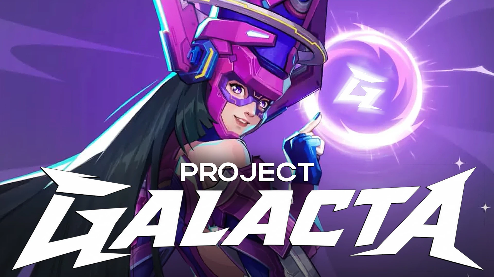

# Project Galacta — Mod Loader & Skin Swapper for Marvel Rivals

**A modding system for Marvel Rivals** — native mod loader, in-game skin swapper, and a companion manager app. No game files are modified on disk; mods are mounted at runtime after login.

📥 **[Download on Nexus Mods](https://www.nexusmods.com/marvelrivals/mods/12806)** · 📦 [Latest Release](../../releases/latest) · 📖 [Full Documentation](https://0xsaturno.github.io/ProjectGalacta/)

---

## What is Project Galacta?

Project Galacta lets you mount custom mod packages for Marvel Rivals and swap hero skins in-game through a live preview grid — all without touching your game's installed files on disk. A companion desktop app scans your mods folder and builds the manifest the in-game skin swapper reads, so there's no manual file editing involved.

## Features

- 🧩 **Mod Loader** — native blueprint mounting for any mod packages, with anti-cheat/security checks
- 🎨 **In-game Skin Swapper** — browse and apply installed mesh mods per hero, with a live preview grid
- 💾 **Persistent preferences** — skin and morph choices saved per hero/costume
- 🎚️ **Morph target sliders** — adjust shape keys live for meshes that ship them
- 🖥️ **Skin Companion App** — scans your mods folder and builds the manifest automatically

## Requirements

- [Rivals SIG Bypasser](https://www.nexusmods.com/marvelrivals/mods/2940) — required to load the Project Galacta mod
- Windows 10/11 and [.NET 8 Desktop Runtime](https://dotnet.microsoft.com/en-us/download/dotnet/8.0) — required for the Companion App

## Installation

1. Download the latest mod and companion app from [Releases](../../releases/latest) or [Nexus Mods](https://www.nexusmods.com/marvelrivals/mods/12806).
2. Extract the `ProjectGalacta` mod container (`.pak`, `.ucas`, `.utoc`) into your game's **Paks** folder.
3. Run the Galacta Companion App and scan your game for compatible mods.
4. Launch the game and log in. Mods are mounted after login — press **P** in a match to open the mesh swapper.

## Documentation

For in-depth guides, technical breakdowns, and FAQ, see the **[Project Galacta website](https://0xsaturno.github.io/ProjectGalacta/)**.

## Safety & Fair Use

- Client-side visuals only — no gameplay logic, hitboxes, or competitive advantage
- Built on native Unreal Engine / Rivals Blueprint code only, rather than external injection methods
- Intentionally blocks config and CameraShake mods to comply with [Marvel Rivals' ToS](https://www.marvelrivals.com/guide/1214569/)

## Changelog

See [CHANGELOG.md](./CHANGELOG.md) for full version history.

**Latest — v1.1.0:** Improved mod loading stability, resolved mod priority issues.

## Credits

Thanks to Xzant for research help and UAT backing on the companion app.

## Links

- 🔗 [Nexus Mods page](https://www.nexusmods.com/marvelrivals/mods/12806)
- 📖 [Documentation site](https://0xsaturno.github.io/ProjectGalacta/)
- 🐛 [Report a bug](../../issues)

---

*Marvel Rivals and all related trademarks are property of NetEase Games / Marvel. This is a fan-made, unofficial modification.*
